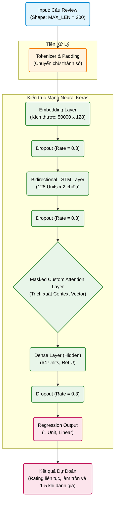

# Kiến Trúc Mô Hình: BiLSTM kết hợp Attention

Dưới đây là sơ đồ kiến trúc chi tiết mô phỏng lại luồng đi của dữ liệu từ khi nhập câu bình luận (Review) cho đến khi đưa ra kết quả dự đoán (1-5 sao).

## Chú giải các thành phần trong sơ đồ:

1. **Input (Đầu vào)**: Đoạn văn bản bình luận của khách hàng. Sẽ được xử lý cắt gọt / đệm (padding) để đảm bảo chuỗi luôn dài đúng 200 từ (`MAX_LEN`).
2. **Embedding**: Lớp giúp chuyển đổi từng con số rời rạc (từ vựng) thành một không gian vector đa chiều (128 chiều). Giúp mô hình hiểu được ngữ nghĩa (semantics) và mối liên hệ giữa các từ.
3. **BiLSTM (Bidirectional LSTM)**: Đây là lớp LSTM đọc 2 chiều. Nó sẽ đọc câu văn từ trái sang phải, và đồng thời đọc ngược từ phải sang trái để thấu hiểu toàn bộ ngữ cảnh của câu. Nó cung cấp Output cho từng từ trong câu.
4. **Attention Mechanism (Cơ chế tập trung)**: Attention gán trọng số cho từng từ rồi nén chuỗi thành context vector. Padding mask được áp dụng trước softmax, nên các token đệm không nhận trọng số attention.
5. **Dense (Lớp kết nối đầy đủ)**: Học các đặc trưng phức tạp từ vector do Attention tạo ra thông qua hàm kích hoạt ReLU.
6. **Output**: Một nơ-ron tuyến tính dự đoán rating liên tục. Mô hình tối ưu weighted MSE; khi đánh giá classification metrics, kết quả được làm tròn và chặn về 1–5.
7. **Dropout**: Được chèn vào giữa các lớp với tỷ lệ 30% (0.3) để tắt ngẫu nhiên các nơ-ron trong quá trình huấn luyện, nhằm tránh hiện tượng mô hình học vẹt (Overfitting).
