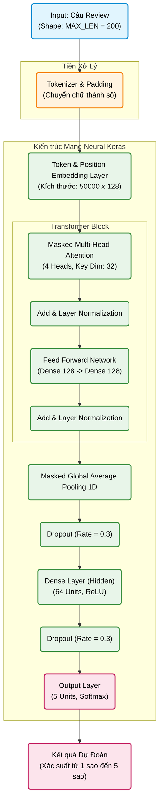

# Kiến Trúc Mô Hình: Transformer

Dưới đây là sơ đồ kiến trúc chi tiết mô phỏng lại luồng đi của dữ liệu từ khi nhập câu bình luận (Review) cho đến khi đưa ra kết quả dự đoán (1-5 sao) sử dụng mô hình Transformer.

## Chú giải các thành phần trong sơ đồ:

1. **Input (Đầu vào)**: Đoạn văn bản bình luận của khách hàng. Sẽ được xử lý cắt gọt / đệm (padding) để đảm bảo chuỗi luôn dài đúng 200 từ (`MAX_LEN`).
2. **Token & Position Embedding**: Kết hợp Word Embedding (nhúng từ vựng thành vector 128 chiều) và Positional Embedding (lưu trữ thông tin vị trí của từ trong câu). Do Transformer xử lý dữ liệu song song (không tuần tự như RNN/LSTM), nó cần thông tin vị trí để hiểu thứ tự của các từ.
3. **Transformer Block**: Khối xử lý cốt lõi của Transformer:
   - **Multi-Head Attention**: Gồm 4 "đầu" (heads) hoạt động song song, mỗi head có chiều 32 để tổng chiều biểu diễn là 128. Padding mask được truyền vào attention để token đệm không ảnh hưởng kết quả.
   - **Feed Forward Network (FFN)**: Mạng truyền thẳng giúp trích xuất các đặc trưng phi tuyến tính sâu hơn từ kết quả của quá trình Attention.
   - **Add & Layer Normalization**: Kỹ thuật chuẩn hóa và cộng kết nối thặng dư (residual connection) giúp mô hình huấn luyện ổn định và tránh được hiện tượng triệt tiêu đạo hàm (vanishing gradient).
4. **Global Average Pooling 1D**: Gom đặc trưng chuỗi thành một vector duy nhất và bỏ qua các vị trí padding thông qua mask.
5. **Dense (Lớp kết nối đầy đủ)**: Học các đặc trưng phức tạp cuối cùng từ vector trước khi phân loại thông qua hàm kích hoạt ReLU.
6. **Output**: Gồm 5 Nơ-ron tương ứng với số sao từ 1 đến 5. Hàm kích hoạt `Softmax` đảm bảo đầu ra là một tỷ lệ phần trăm (%), phân loại có xác suất cao nhất chính là kết quả dự đoán của mô hình. 
7. **Dropout**: Được chèn vào giữa các lớp với tỷ lệ 30% (0.3) để tắt ngẫu nhiên các nơ-ron trong quá trình huấn luyện, nhằm tránh hiện tượng mô hình học vẹt (Overfitting).
